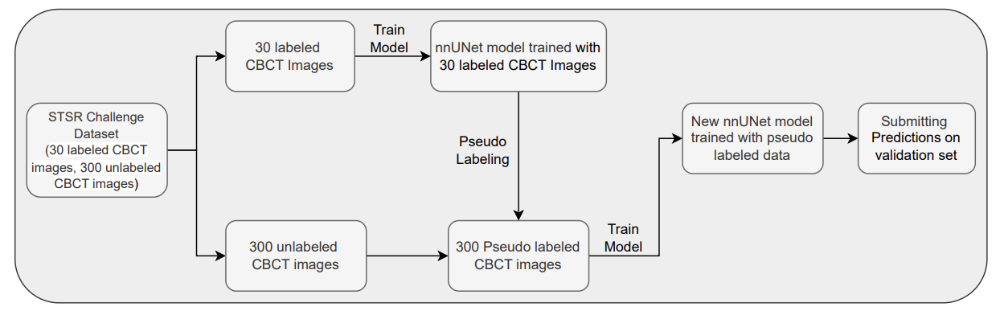

# MICCAI 2025 – Semi-supervised Tooth and Pulp Root Canal Segmentation in CBCT (STSR Task 1)


This repository contains the public release of our semi-supervised framework with nnUNet.


## Method
This paper presents a solution for the Semi-supervised Teeth Segmentation and Registration (STSR) 2025 Challenge, which focused on the precise segmentation of teeth and pulp root canals in 3D Cone Beam Computed Tomography (CBCT) scans. 

The presented approach uses a semi-supervised framework powered by nnU-Net, leveraging a small labeled dataset of 30 scans alongside a much larger unlabeled dataset of 300 scans. To effectively utilize the unlabeled data, pseudo-labeling was employed to generate annotations, and the model was subsequently trained. 

### Overview



The results for both tooth and pulp struc tures yield a Dice score of 0.8088 and an mIoU of 0.9638 in the all-data track, while the Dice score in the coreset track is 0.69.


@slicer.org


---

## Environment Setup

### 1. Dataset

Download the official STSR-Task-2 dataset from Codabench (competition page).

https://www.codabench.org/competitions/6468/

### 2. Inference

Using the Provided Model
```bash
sh predict.sh
```

---

